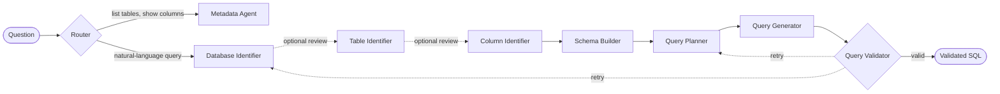

<div align="center">

# Lang2Query

**Ask your database a question in plain English. Get back validated SQL.**

[](https://python.org)
[](https://fastapi.tiangolo.com)
[](https://langchain-ai.github.io/langgraph/)
[](https://www.trychroma.com)
[](https://nextjs.org)
[](https://react.dev)
[](https://www.typescriptlang.org)
[](https://www.docker.com)
[](LICENSE)

[Quick Start](#quick-start) · [How it works](#how-it-works) · [Features](#features) · [Docs](#documentation)

</div>

<!--
  Add a demo screenshot or short GIF here once available, e.g.:
  <p align="center"></p>
-->

## What it does

Lang2Query converts a natural-language question into a correct SQL query against one of several documented databases — no schema knowledge required. Instead of one LLM call given the whole schema, the request flows through a chain of specialized LangGraph agents that each narrow the search space, backed by a RAG layer over hand-written schema docs, with optional human-in-the-loop checkpoints before committing to a set of tables.

> **Status:** functional prototype under active development — great for demos and single-user use, not yet hardened for multi-user production load (no auth, no rate limiting, no execution-time safety guardrails beyond read-only enforcement).

## How it works



Each identification step is backed by agentic RAG: the LLM itself chooses which retrieval tool to call (semantic search, per-database, per-table) against a ChromaDB knowledge base of BGE-M3 embeddings, pulling in only the schema slice it needs rather than the whole schema at once.

## Quick Start

### Docker (recommended)

```bash
git clone git@github.com:nithiin7/lang2query.git
cd lang2query
cp env.example .env        # add your OPENAI_API_KEY
docker-compose -f docker/docker-compose.yml --project-directory . up -d
```

Web UI → `http://localhost:3000` · API docs → `http://localhost:8000/docs`

### Local development

```bash
git clone git@github.com:nithiin7/lang2query.git
cd lang2query
make venv && source venv/bin/activate
make install && make download
make dev
```

Full Docker walkthrough (services, dev vs. prod, hot reload): **[DOCKER.md](DOCKER.md)**

## Features

- **Multi-agent pipeline** — LangGraph agents narrow database → tables → columns → query plan before generating SQL, instead of one LLM call against the full schema
- **Agentic RAG retrieval** — the LLM chooses which retrieval tool to call over a ChromaDB knowledge base, rather than always injecting top-k chunks
- **Human-in-the-loop checkpoints** — pause after database/table selection for review, backed by real WebSocket pause/resume
- **Streaming UI** — Next.js frontend shows each agent's progress live as the query is processed
- **Pluggable LLM providers** — OpenAI, Ollama, or local Hugging Face models behind one provider interface
- **Read-only by design** — every SQL-generation path is read-only; no write queries are ever produced

## Project Structure

```
lang2query/
├── frontend/                # Next.js frontend (React 19, TypeScript, Tailwind)
│   └── src/
│       ├── app/(dashboard)/chat/  # The query UI, at /chat ("/" redirects here)
│       └── components/            # chat/, ui/, and shared chrome (Header/)
├── backend/                 # Python backend
│   ├── app/
│   │   ├── modules/query/     # LangGraph agents + workflow — one file per agent
│   │   ├── api/                 # FastAPI routes (REST + WebSocket)
│   │   ├── ai/                   # LLM provider abstraction (llm/) + RAG retrieval stack
│   │   ├── workers/              # Ingestion pipeline (document_ingestion.py)
│   │   ├── models/                # Pydantic schemas — the typed AgentState contract
│   │   └── tools/                  # LangChain @tool retrieval functions
│   ├── tests/
│   └── pyproject.toml       # Python dependencies
├── docker/                  # Dockerfile + docker-compose (prod & dev)
└── Makefile                 # Build automation
```

## Documentation

| Doc | Covers |
| --- | --- |
| [DOCKER.md](docker/DOCKER.md) | Full Docker guide — services, dev vs. prod, troubleshooting |
| [CONTRIBUTING.md](CONTRIBUTING.md) | Dev setup, coding standards, PR process |
| [backend/README.md](backend/README.md) | Backend architecture, agents, API reference |

## License

MIT — see [LICENSE](LICENSE).
